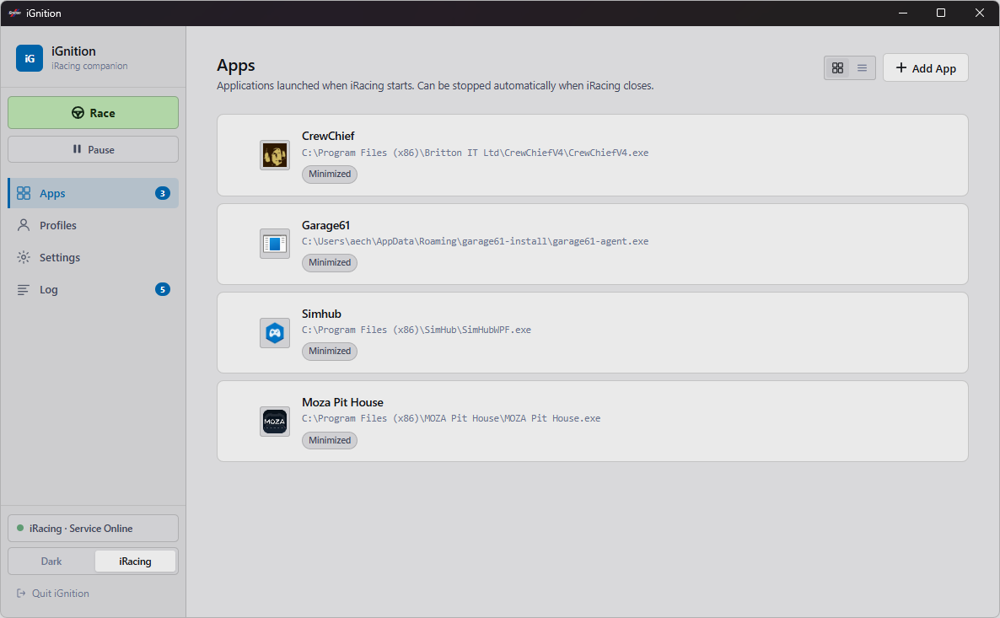
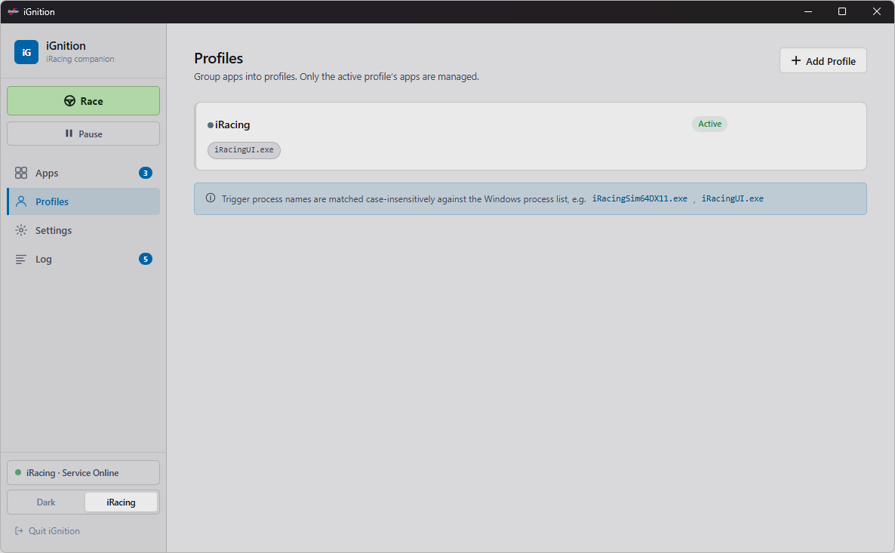
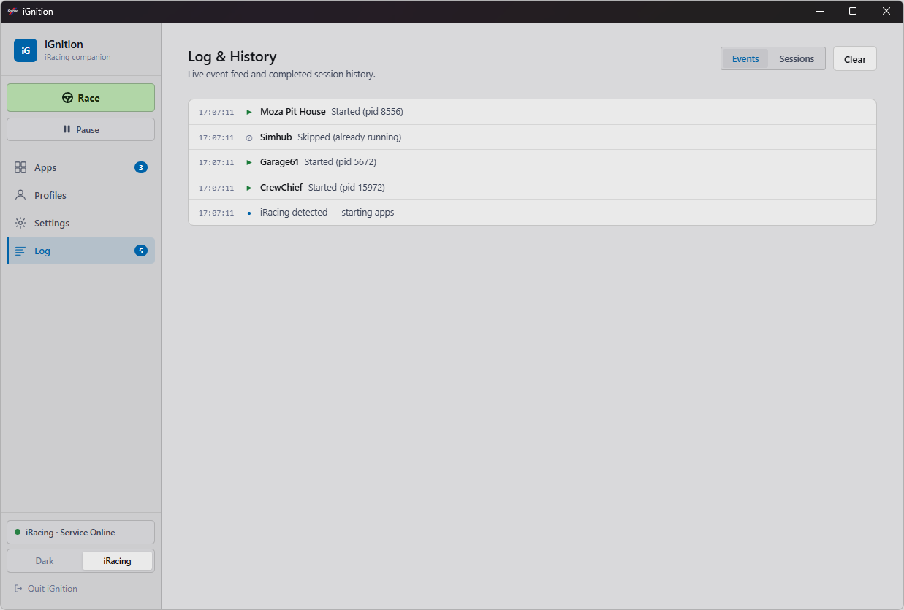

<div align="center">

# iGnition

**Launch your sim tools when iRacing starts. Close them when it stops.**

[](https://github.com/aechXIII/iGnition/releases)
[](LICENSE)
[]()
[](https://buymeacoffee.com/aechxiii)

</div>

---

iGnition sits in the system tray and watches for iRacing. When the sim starts, it launches whatever tools you have set up: SimHub, CrewChief, VoiceAttack, anything. When the sim closes, it shuts them all down.

No scripts. No manual launching. Just race.

---

## Screenshots








---

## vs iRacingManager

If you have used [iRacingManager](https://github.com/Sebbe2010/iRacingManager) before, iGnition is a spiritual successor. Same idea, built differently:

- Fresh UI with a dark theme and an iRacing-style light theme
- Per-app start delays so tools that need a moment to initialize actually get one
- Wait-for-process ordering, so app B only launches after app A is running
- Multiple profiles, each with its own trigger process and app list
- Tray icon that quits properly when you tell it to
- No .NET runtime required, just the app

---

## Features

- Auto-launch and auto-stop apps tied to iRacing
- Trigger on the iRacing UI process or only when you drop into a session
- Per-app start delay and process dependency ordering
- Profiles for different car types, series, or setups
- System tray with quick profile switching
- Session history with duration and app list
- Start with Windows, minimized to tray

---

## Installation

1. Grab the latest **iGnition-Setup-x.x.x.exe** from [Releases](https://github.com/aechXIII/iGnition/releases)
2. Run the installer (no admin rights needed)
3. iGnition installs to `%LOCALAPPDATA%\iGnition`

**Requirements:** Windows 10 or 11 (64-bit). Edge WebView2 Runtime is required and is already built into Windows 11. Windows 10 users can grab it free from [Microsoft](https://developer.microsoft.com/en-us/microsoft-edge/webview2/).

---

## Development

### Setup

```powershell
./scripts/setup.ps1
```

Creates a virtual environment and installs dependencies. To do it manually:

```powershell
python -m venv .venv
.venv\Scripts\Activate.ps1
pip install -r requirements.txt
```

### Run

```powershell
./scripts/run.ps1
```

Optional flags: `-Background` (no console window), `-Headless` (no UI, tray only).

### Build

```powershell
# EXE only
./scripts/build.ps1 -Clean

# EXE + installer (requires Inno Setup 6)
./scripts/build.ps1 -Clean -Installer
```

Output: `dist\iGnition.exe` and `installer\Output\iGnition-Setup-0.1.0.exe`

### Tests

```powershell
pip install -r requirements-dev.txt
pytest
```

---

## User data

| | Path |
|---|---|
| Config | `%LOCALAPPDATA%\iGnition\iGnition\config.json` |
| Logs | `%LOCALAPPDATA%\iGnition\iGnition\Logs\ignition.log` |
| Sessions | `%LOCALAPPDATA%\iGnition\iGnition\session_history.json` |

---

## License

MIT. See [LICENSE](LICENSE).
